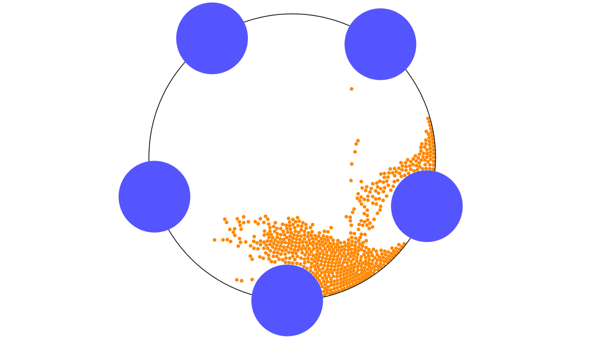

### About 
This is a simple demo was inspired by PBD Papers by Matthias Muller et. al.
It shows simple simulation of many particles and some moving boundaries.
Particle friction is simulated using two different approaches found in PBD papers.

### Code 
This source code is based on a template from [Tutorial 5](https://github.com/matthias-research/pages/blob/master/tenMinutePhysics/05-bead.html) of [Ten Minute Physics](https://matthias-research.github.io/pages/tenMinutePhysics/index.html) though it is heavily modified by me so I am solely responsible for all the added bugs :-)

For one file drop-in demo check out *pbd-web-demo-onefiletorulethemall.html*
this is the same demo, just all code it in one file.

### Mandatory screenshot

